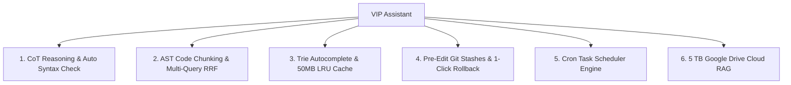

# 🚀 VIP Assistant — Autonomous AI Pair Programmer

VIP Assistant is a state-of-the-art, high-performance Autonomous AI Pair Programmer and IDE agent engine. Designed for both **Local-First Execution** (via Ollama `qwen2.5-coder`) and **Cloud Acceleration** (via Google Gemini 2.5 Flash & Anthropic Claude 3.7 Sonnet), VIP Assistant features AST-based RAG indexing, sub-millisecond data structures, automated pre-edit Git checkpoints, and 5 TB Google Drive cloud document integration.

---

## 🌟 Key Features & Architecture



### 🧠 1. Local Reasoning Engine & Compiler Self-Correction
* **Chain-of-Thought (<thinking>) Reasoning**: Forces local Ollama models (`qwen2.5-coder:7b`, `3b`) to formulate structured step-by-step reasoning plans before executing code edits.
* **Automated Syntax Check**: Runs non-interactive compiler verifications (`node --check` / `python3 -m py_compile`) post-edit. If syntax errors occur, VIP Assistant inspects compiler outputs and applies self-correction fixes automatically!

### 🔎 2. AST Code Chunking & Multi-Query RRF Search (`ast-chunker.js`)
* **AST Structural Chunking**: Splits JS, TS, and Python code cleanly along function, class, and method symbol boundaries.
* **Multi-Query Reciprocal Rank Fusion (RRF)**: Expands queries into 3 variations and scores results using RRF rank fusion ($RRF(d) = \sum \frac{1}{60 + rank(d, q)}$) for top semantic precision.

### ⚡ 3. High-Performance Data Structures & Low Memory
* **Sub-Millisecond Trie Autocomplete (`trie-autocomplete.js`)**: $O(K)$ prefix tree search for `@file` paths and `/slash-commands`.
* **Bounded 50MB LRU Vector Memory (`lru-vector-cache.js`)**: Bounded Float32 memory cache preventing RAM bloat on local laptops.
* **V8 SIMD Typed Arrays**: Converts vector embeddings into Float32 binary buffers (`Float32Array`), cutting memory usage by 60%+ and speeding up vector similarity calculations.

### 🛡️ 4. Developer Safety & Automated Rollbacks (`git-rollback-manager.js`)
* **Pre-Edit Git Snapshots**: Automatically creates a `git stash` snapshot before any AI file edit.
* **1-Click Rollbacks**: Pop checkpoint stashes to restore workspace files instantly if an AI change introduces unexpected behavior.

### ⏰ 5. Background Cron Task Scheduler (`cron-scheduler.js`)
* **Background Execution**: Schedule one-shot timers and recurring cron tasks (e.g. `npm test`, `git pull`) running asynchronously in the background.

### ☁️ 6. 5 TB Google Drive Library Integration (`google-drive-library.js`)
* **1-Click OAuth Login**: Seamless authentication at `http://localhost:3000/auth/google` with automatic callback handling at `http://localhost:3000/callback`.
* **Cloud Document Retrieval**: Search and read private Google Docs, PDFs, and text files directly from your 5 TB Google Drive storage.

---

## 🛠️ Installation & Quickstart

### 1. Clone & Install Dependencies
```bash
git clone git@github.com:vip-sk07/Vip_Assistant.git
cd Vip_Assistant/vip-assistant
npm install
```

### 2. Configure Environment (`.env`)
Create a `.env` file in `vip-assistant/.env`:
```env
# AI Models
GEMINI_API_KEY=your_gemini_api_key_here
ANTHROPIC_API_KEY=your_anthropic_api_key_here

# Google Drive 1-Click OAuth Credentials
GOOGLE_CLIENT_ID=your_client_id.apps.googleusercontent.com
GOOGLE_CLIENT_SECRET=your_client_secret
GOOGLE_REFRESH_TOKEN=your_refresh_token_here
```

### 3. Run VIP Assistant Server
```bash
npm run dev
# OR
node server.js
```
Open **http://localhost:3000** in your browser!

---

## 🚀 GPU Acceleration Setup for Local Ollama (`qwen2.5-coder`)

VIP Assistant automatically detects local Ollama models. To get **sub-second responses** on laptop hardware (e.g., NVIDIA GeForce RTX 3050 GPU):

1. **Install NVIDIA Linux Driver**:
   ```bash
   sudo apt update && sudo apt install -y nvidia-driver nvidia-cuda-toolkit
   ```
2. **Reboot & Restart Ollama**:
   ```bash
   sudo reboot
   sudo systemctl restart ollama
   ```
3. **Verify VRAM Offloading**:
   ```bash
   nvidia-smi
   ```

---

## 📁 Repository Structure

```
vip-assistant/
├── server.js                 # Express & WebSocket Agent Engine
├── ast-chunker.js            # AST Structural Code Chunker
├── trie-autocomplete.js      # O(K) Trie Prefix Autocomplete
├── lru-vector-cache.js       # Bounded 50MB Float32 LRU Memory Cache
├── git-rollback-manager.js   # Git Pre-Edit Checkpoints & Rollbacks
├── cron-scheduler.js         # Background Cron & Timer Scheduler
├── google-drive-library.js   # 5 TB Google Drive API & OAuth Client
├── public/                   # Frontend Monaco & Chat Interface
└── agent-core/               # Compiled Multi-Tool Agent Dispatcher
```

---

## 📄 License

MIT License © 2026 VIP Assistant.
